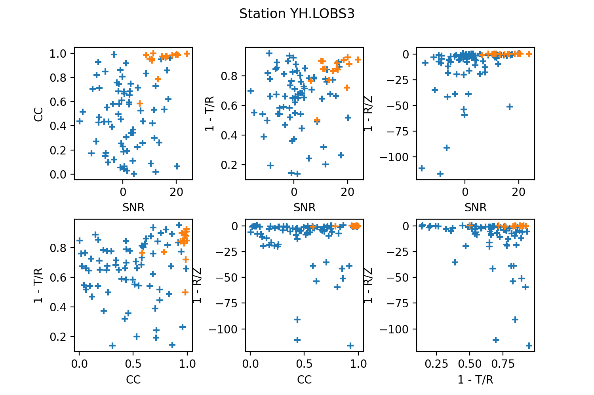
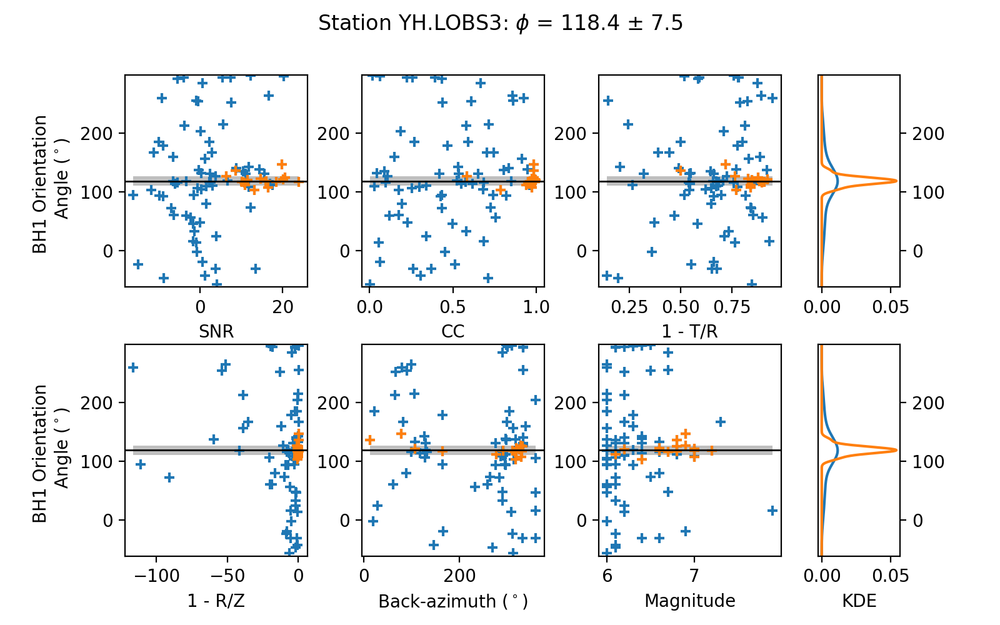
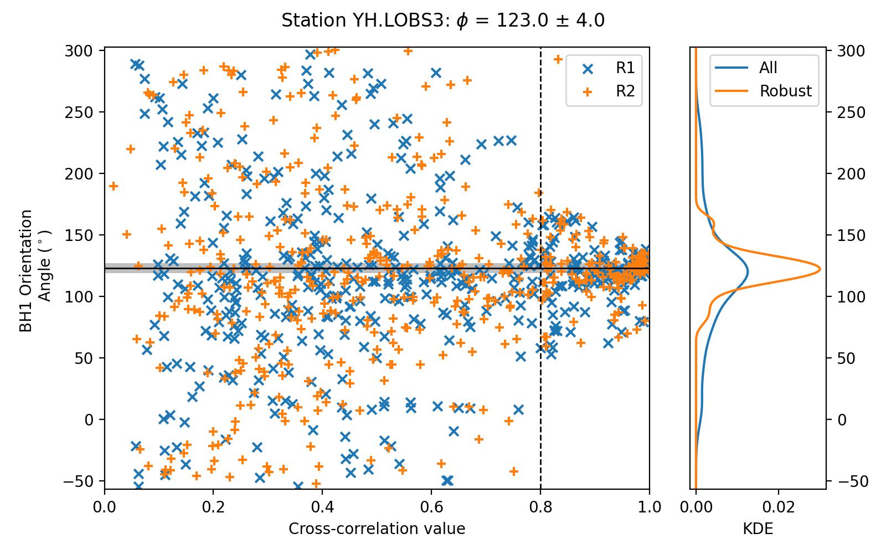

Tutorials
=========

Creating the ``StDb`` Database
++++++++++++++++++++++++++++++

All the scripts provided require a ``StDb`` database containing station
information and metadata. Let's first create this database for station
LOBS3 and send the prompt to a logfile

.. code-block::

   $ query_fdsn_stdb.py -N YH -C ?H? -S LOBS3 YH_list > logfile

To check the station info for M08A, use the program ``ls_stdb.py``:

.. code-block::

    $ ls_stdb.py YH_list.pkl
    Listing Station Pickle: YH_list.pkl
    YH.LOBS3
    --------------------------------------------------------------------------
    1) YH.LOBS3
         Station: YH LOBS3
          Alternate Networks: None
          Channel: HH ;  Location: --
          Lon, Lat, Elev: -38.79220,  179.14729,  -3.540
          StartTime: 2014-05-15 00:00:00
          EndTime:   2015-06-23 23:59:59
          Status:    open
          Polarity: 1
          Azimuth Correction: 0.000000

BNG analysis
++++++++++++

1. Automated analysis
---------------------

We wish to use the entire deployment time of station LOBS3 to calculate the
station orientation using teleseismic P-wave data. Since the file ``YH_list.pkl`` 
contains only one station, it is not necessary to specify a
key. This option would be useful if the database contained several stations
and we were only interested in downloading data for LOBS3. In this case, we would
specify ``--keys=LOBS3`` or ``--keys=YH.LOBS3``. We could use all the default 
paramaters to do automated processing for regional events. 
However, since we wish to analyze teleseismic data, we will edit a few of them to 
include more waveform data around the predicted P-wave
arrival time. We also consider all earthquakes between 30 and 175 degrees, as the
program will automatically use either the P or PP waves to extract the waveforms.

The parameters to edit in this case are:
``--times=-5.,15.`` to extract data from -5 to 15 seconds following P-wave arrival;
``--window=60.`` to include 60 seconds of data; 
``--minmax=6.`` to limit the number of events to consider;
``--mindist=30.`` for the minimum epicentral distance for teleseismic P; and
``--bp=0.04,0.1`` to focus on the long-period P waves

.. code-block::

    $ bng_calc_auto.py --times=-5.,15. --window=60. --bp=0.04,0.1 --min-mag=6. --min-dist=30. YH_list.pkl

An example log printed on the terminal will look like:

.. code-block::

    |==============================================|
    |                      LOBS3                   |
    |==============================================|
    |  Station: YH.LOBS3                           |
    |      Channel: HH; Locations: --              |
    |      Lon:  179.15; Lat: -38.79               |
    |      Start time: 2014-05-15 00:00:00         |
    |      End time:   2015-06-23 23:59:59         |
    | Output Directory:  BNG_RESULTS
    | Save Progress:  True
    |----------------------------------------------|
    | Searching Possible events:                   |
    |   Start: 2014-05-15 00:00:00                 |
    |   End:   2015-06-23 23:59:59                 |
    |   Mag:   >6.0                                |
    |   Min Distance:  30.0
    |   Max Distance:  175.0
    |   Max Depth:     1000.0
    |   Request Event Catalogue...                 |
    | ...                                          |
    |   Retrieved 178 events 

     
    **************************************************
    * (1/178):  20150623_121830 YH.LOBS3
    *   Phase: P
    *   Origin Time: 2015-06-23 12:18:30
    *   Lat:  27.69;        Lon:  139.79
    *   Dep: 472.30 km;     Mag: 6.5
    *   Dist: 8420.96 km;   Epi dist:  75.73 deg
    *   Baz:  324.49 deg;   Az: 149.23 deg
    * Requesting Waveforms: 
    *    Startime: 2015-06-23 12:28:26
    *    Endtime:  2015-06-23 12:30:26
    *     LOBS3.HH - ZNE:
    *          HH[ZNE].-- - Checking Network
    *          HH[Z12].-- - Checking Network
    * Stream has less than 3 components
    * Error retrieving waveforms
    **************************************************
     
    **************************************************
    * (3/178):  20150620_021007 YH.LOBS3
    *   Phase: P
    *   Origin Time: 2015-06-20 02:10:07
    *   Lat: -36.33;        Lon:  -73.67
    *   Dep:  17.40 km;     Mag: 6.4
    *   Dist: 8837.94 km;   Epi dist:  79.48 deg
    *   Baz:  128.47 deg;   Az: 229.25 deg
    * Requesting Waveforms: 
    *    Startime: 2015-06-20 02:21:13
    *    Endtime:  2015-06-20 02:23:13
    *     LOBS3.HH - ZNE:
    *          HH[ZNE].-- - Checking Network
    *          HH[Z12].-- - Checking Network
    *              - Z12 Data Downloaded
    * Start times are not all close to true start: 
    *   HH1 2015-06-20T02:21:13.169200Z 2015-06-20T02:23:13.159182Z
    *   HH2 2015-06-20T02:21:13.170000Z 2015-06-20T02:23:13.159982Z
    *   HHZ 2015-06-20T02:21:13.171300Z 2015-06-20T02:23:13.161282Z
    *   True start: 2015-06-20T02:21:13.169017Z
    * -> Shifting traces to true start
    * Sampling rate is not an integer value:  100.00001525878906
    * -> Resampling
    * Waveforms Retrieved...
    * PHI: 130.9734219019316
    * SNR: 15.56466980049146
    * CC: -0.5339708571207897
    * 1-T/R: 0.6621867327600115
    * 1-R/Z: -2.0528273045414216

    ...

And so on until all waveforms have been downloaded and processed. You will
notice that a folder called ``BNG_RESULTS/YH.LOBS3/`` has been created.
This is where all processed files will be stored on disk. 

2. Averaging
------------

Now that all events have been processed, we wish to produce an average value
of station orientation. However, not all estimates have equal weight in the
final average. In particular, Braunmiller et al. (2020) have shown how a
combination of parameters can be used to exclude poorly constrained estimates
to produce a more robust final estimate. Here we will use all default values
in the script and specify arguments to plot and save final figures.

.. code-block:: 

    $ bng_average.py --plot --save YH_list.pkl

An example log printed on the terminal will look like:

.. code-block::

    |==============================================|
    |                      LOBS3                   |
    |==============================================|
    |  Station: YH.LOBS3                           |
    |      Channel: HH; Locations: --              |
    |      Lon:  179.15; Lat: -38.79               |
    | Input Directory:  BNG_RESULTS
    | Plot Results:  True
    |
    |    B-N-G mean, error, data included: 118.44, 7.49, 16

The first figure to pop up will show the various combinations
of quality factors, highlighting the estimates that pass the 
selected (default) thresholds

The second figure displays the estimates according to three parameters:

* Signal-to-noise ratio (SNR)
* Cross-correlation coefficient (CC)
* Earthquake magnitude

DL analysis
+++++++++++

1. Automated analysis
---------------------

We wish to use the entire deployment time of station LOBS3 to calculate the
station orientation using Rayleigh-wave polarization data. Following the previous
example, since the file ``YH_list.pkl`` contains only one station, it is not 
necessary to specify a key. Here we use all default parameters, except for the
minimum earthquake magnitude, which we set to 6.

.. code-block::

    $ dl_calc.py --min-mag=6. YH_list.pkl

An example log printed on the terminal will look like:

.. code-block::

       Establishing Catalogue Client...
          Done
       Establishing Waveform Client...
          Done
     
    |==============================================|
    |                      LOBS3                   |
    |==============================================|
    |  Station: YH.LOBS3                           |
    |      Channel: HH; Locations: --              |
    |      Lon:  179.15; Lat: -38.79               |
    |      Start time: 2014-05-15 00:00:00         |
    |      End time:   2015-06-23 23:59:59         |
    | Output Directory:  DL_RESULTS
    | Save Progress:  True
    |----------------------------------------------|
    | Searching Possible events:                   |
    |   Start: 2014-05-15 00:00:00                 |
    |   End:   2015-06-23 23:59:59                 |
    |   Mag:   >{0:3.1f} 6.0                       |
    |   Min Distance:  5.0
    |   Max Distance:  175.0
    |   Max Depth:     150.0
    |   Request Event Catalogue...                 |
    | ...                                          |
    |   Retrieved 178 events 

     
    **************************************************
    * (3/178):  20150620_021007 YH.LOBS3
    *   Origin Time: 2015-06-20 02:10:07
    *   Lat: -36.33;        Lon:  -73.67
    *   Dep:  17.40 km;     Mag: 6.4
    *   Dist: 8837.94 km;   Epi dist:  79.48 deg
    *   Baz:  128.47 deg;   Az: 229.25 deg
    * Requesting Waveforms: 
    *    Startime: 2015-06-20 02:10:07
    *    Endtime:  2015-06-20 06:10:07
    *     LOBS3.HH - ZNE:
    *          HH[ZNE].-- - Checking Network
    *          HH[Z12].-- - Checking Network
    *              - Z12 Data Downloaded
    * Start times are not all close to true start: 
    *   HH1 2015-06-20T02:10:07.650900Z 2015-06-20T06:10:07.638703Z
    *   HH2 2015-06-20T02:10:07.651100Z 2015-06-20T06:10:07.638903Z
    *   HHZ 2015-06-20T02:10:07.659300Z 2015-06-20T06:10:07.637103Z
    *   True start: 2015-06-20T02:10:07.650000Z
    * -> Shifting traces to true start
    * Sampling rate is not an integer value:  100.00001525878906
    * -> Resampling
    * Waveforms Retrieved...
    * R1PHI: [ 108.2734219  117.2734219  125.0734219  126.8734219  112.5734219
      101.3734219  121.3734219]
    * R2PHI: [ 120.3734219  114.6734219  114.8734219    9.3734219    4.4734219
      319.2734219   88.3734219]
    * R1CC: [ 0.3929253   0.63498115  0.79618113  0.76866093  0.52087365  0.28555018
      0.27791771]
    * R2CC: [ 0.27178087  0.07950989  0.16644224  0.51027084  0.24789322  0.04376891
      0.03245475]

    ...

And so on until all waveforms have been downloaded and processed. You will
notice that a folder called ``DL_RESULTS/YH.LOBS3/`` has been created.
This is where all processed files will be stored on disk. 

2. Averaging
------------

Now that all events have been processed, we wish to produce an average value
of station orientation. However, not all estimates have equal weight in the
final average. In particular, Doran and Laske have shown how to specify a 
threshold cross-correlation (CC) value to exclude waveforms for which the CC
between the radial and Hilbert-transformed vertical component is low. Here we use
the default CC threshold of 0.8 and produce a final plot with the estimate. 

.. code-block:: 

    $ dl_average.py --plot YH_list.pkl

An example log printed on the terminal will look like:

.. code-block::

    |==============================================|
    |                      LOBS3                   |
    |==============================================|
    |  Station: YH.LOBS3                           |
    |      Channel: HH; Locations: --              |
    |      Lon:  179.15; Lat: -38.79               |
    | Input Directory:  DL_RESULTS
    | Plot Results:  True
    |
    |    D-L mean, error, data included: 122.95, 3.99, 284
    |    D-L CC level: 0.8

The figure displays the estimates according to the CC value:

